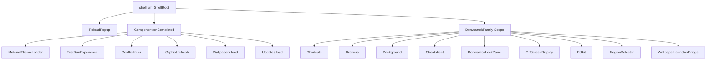

# Donwaztok — Hyprland + Quickshell dotfiles

Personal configuration for **Arch Linux** (or derivatives): **Hyprland**, **Quickshell** (`donwaztok` shell), **Kitty** terminal, **Fuzzel** launcher, **Zsh**, GTK/Qt theming, the XDG portal, and install scripts. The goal is a cohesive desktop session with a bar, drawers, lock screen, keybindings, and M3 (Material) integration in the Quickshell layer.

**This fork / customization:** [github.com/Donwaztok/hyprland-quickshell](https://github.com/Donwaztok/hyprland-quickshell)

---

## Credits and code provenance

This project **is not built from scratch**. Much of the architecture, Quickshell modules, Hyprland conventions, and usage docs come from upstream projects. **Credit belongs to the authors of those repositories**; this repo documents the base and local changes (Donwaztok) only.

### Illogical Impulse (ii) — [end-4/dots-hyprland](https://github.com/end-4/dots-hyprland)

The **dots-hyprland** setup (also called **Illogical Impulse** or **ii**) is the main source of inspiration and shared code: `hypr/` layout (defaults + `custom/`), Quickshell integration, wiki, and configuration flows. Most of what you see under `quickshell/donwaztok/`, shell startup, modules, and supporting docs derives from or evolves out of that base.

- **Upstream:** [https://github.com/end-4/dots-hyprland](https://github.com/end-4/dots-hyprland)  
- **Wiki (incl. ii-qs):** [dots-hyprland-wiki](https://end-4.github.io/dots-hyprland-wiki/en/ii-qs/02usage/)

If you reuse material from this repo, **attribute and comply with the original project’s license and terms** (end-4).

### Caelestia Shell — [caelestia-dots/shell](https://github.com/caelestia-dots/shell)

Several files incorporate or adapt **Caelestia** (Quickshell) code, as noted in file comments — e.g. services and shared widgets (`Network`, `Brightness`, `Icons`, `DirectoryIcon`, and others). That project is **GPLv3**; local changes must stay compatible with that license wherever derived code applies.

- **Upstream:** [https://github.com/caelestia-dots/shell](https://github.com/caelestia-dots/shell)

**Summary:** Donwaztok is a **customization and continuation** of ii/dots-hyprland, with **explicit Caelestia-derived pieces**; original design credit goes to **end-4** and **caelestia-dots** (and other upstream contributors).

---

## Requirements and installation

- **Arch Linux** (or derivative) with AUR access (`yay`).

```bash
git clone https://github.com/Donwaztok/hyprland-quickshell.git ~/.config
cd ~/.config
chmod +x install.sh
./install.sh
```

`install.sh` sets mirrors, installs packages from `app.lst`, themes (cursor, SDDM, GTK, icons, GRUB), desktop files under `~/.local/share/applications/`, and services (sddm, NetworkManager, bluetooth, ydotool).

**Handy shortcuts:** Super+/ — shortcut list; Super+Enter — terminal (Kitty).

**Packages:** see `app.lst`; typical install: `yay --removemake --cleanafter -S $(awk '!/^#/ {print $1}' app.lst)`. Quickshell usually comes from `quickshell-git` (AUR).

---

## Repository layout (overview)

```
~/.config/
├── app.lst, install.sh
├── .zshrc, starship.toml
├── donwaztok/config.json          # M3 JSON + "shell" key
├── hypr/                          # Hyprland: hyprland.conf, custom/, hyprland/, themes, …
├── quickshell/donwaztok/          # Quickshell ($qsConfig = donwaztok)
│   ├── shell.qml
│   ├── config/, components/, modules/, services/ (+ services/m3/)
│   └── …
├── kitty/, foot/, fuzzel/, wlogout/, mako/, btop/, fastfetch/, mpv/
├── fontconfig/, xdg-desktop-portal/
└── …
```

**What to track in git:** Hypr/shell (`hypr/`, `quickshell/`, `fuzzel/`, portal), terminals, notifications, fonts, app flags, optional KDE/Qt files depending on your setup.

**Quickshell:** `QML2_IMPORT_PATH` points at `~/.config/quickshell/donwaztok` (see `hypr/hyprland/env.conf`). Do not move `qs.*` trees without fixing imports.

---

## Hyprland: `source` order

In `hypr/hyprland.conf`:

1. `hyprland/env.conf` → `custom/env.conf`
2. Defaults: `execs`, `general`, `rules`, `colors`, `keybinds`
3. Custom: `custom/execs`, `general`, `rules`, `keybinds`
4. `workspaces.conf`, `monitors.conf`

**`$qsConfig = donwaztok`** lines up the `qs` binary with this Quickshell tree.

---

## Quickshell Donwaztok: main imports

| Import | Folder |
|--------|--------|
| `qs.utils` | `utils/` |
| `qs.config` | `config/` |
| `qs.components` | `components/` |
| `qs.modules` | `modules/` |
| `qs.services` | `services/*.qml` |
| `qs.services.m3` | `services/m3/` |

**JSON config:** `~/.config/donwaztok/config.json` — **`shell`** key and top-level M3 block (**appearance**, **bar**, …).

**State:** `~/.local/state/donwaztok/`. App keyring: **`donwaztok`** (legacy `illogical-impulse` entries may remain after migrating from ii — use `secret-tool` to clear if needed).

**M3 theme:** colors in `quickshell/donwaztok/services/m3/Colours.qml`; Hyprland/Fuzzel/hyprlock in `hypr/` and `fuzzel/`. Light/dark via `gsettings` / scripts exposed in the shell.

**Note:** duplicate names exist under `services/` vs `services/m3/` with different APIs — `qs.services` and `qs.services.m3` imports are not interchangeable.

---

## Shell startup (`shell.qml`)



---

## Performance and maintenance (quick notes)

- **Hyprland blur:** high `passes` / `size` is GPU-heavy; lower on weaker hardware.
- **Clipboard / `wl-paste`:** multiple watchers can spam IPC; debounce if you see spikes.
- **`QML2_IMPORT_PATH`:** export the same outside a Hyprland session if you run `qs` manually.
- **Palette:** changing `Colours.qml` means manually aligning `colors.conf`, Fuzzel, and GTK for a consistent look.
- **Allowlist `.gitignore`:** new files may be untracked until you add `!` exceptions.
- **`install.sh` / `app.lst`:** long opinionated list; for minimal setups, consider splitting lists or profiles.

Update this README when you change the JSON schema, the main shell family, or Hyprland `source` order.
