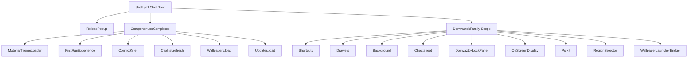

# Hyprland + Quickshell (Donwaztok)

Dotfiles para Hyprland, Quickshell, Zsh, Kitty, Fuzzel e ferramentas relacionadas (inspirado em [end-4/dots-hyprland](https://github.com/end-4/dots-hyprland)).

**Repositório:** [github.com/Donwaztok/hyprland-quickshell](https://github.com/Donwaztok/hyprland-quickshell)

---

## Requisitos e instalação

- **Arch Linux** (ou derivado) com acesso ao AUR (`yay`).

```bash
git clone https://github.com/Donwaztok/hyprland-quickshell.git ~/.config
cd ~/.config
chmod +x install.sh
./install.sh
```

O `install.sh` configura mirrors, instala pacotes de `app.lst`, temas (cursor, SDDM, GTK, ícones, GRUB), desktop files em `~/.local/share/applications/` e serviços (sddm, NetworkManager, bluetooth, ydotool).

**Atalhos úteis:** Super+/ — lista de atalhos; Super+Enter — terminal (Kitty).

**Pacotes:** lista plana em `app.lst`; instalação típica com `yay --removemake --cleanafter -S $(awk '!/^#/ {print $1}' app.lst)`. O shell Quickshell depende de `quickshell-git` (AUR).

---

## Árvore lógica do repositório (ficheiros versionados)

Contagem aproximada por diretório de topo: **quickshell/** (maior parte do repo), **hypr/**, restantes (kitty, fuzzel, etc.).

```
~/.config/  (raiz do clone)
├── app.lst
├── install.sh
├── .zshrc
├── starship.toml
├── kdeglobals, konsolerc, dolphinrc, darklyrc
├── *-flags.conf          # chrome, code, thorium
├── donwaztok/
│   └── config.json       # JSON M3 + chave "shell"; lido por DonwaztokConfigStore (Quickshell)
├── hypr/
│   ├── hyprland.conf     # Ordem de source (ver secção Hyprland)
│   ├── workspaces.conf, monitors.conf
│   ├── hypridle.conf, hyprlock.conf
│   ├── custom/           # Overrides do utilizador (env, execs, general, rules, keybinds, scripts)
│   ├── hyprland/         # Defaults partilháveis (env, execs, general, rules, keybinds, colors, scripts/)
│   ├── hyprlock/
│   ├── themes/
│   └── source/           # SDDM tarball, .desktop
├── quickshell/donwaztok/ # Shell Quickshell ($qsConfig = donwaztok)
│   ├── shell.qml         # Entrada; QML2_IMPORT_PATH em hypr/hyprland/env.conf → quickshell/donwaztok
│   ├── GlobalStates.qml, ReloadPopup.qml, welcome.qml, settings.qml, killDialog.qml
│   ├── panelFamilies/    # DonwaztokFamily, DonwaztokLockPanel, pontes
│   ├── config/           # qs.config (Config, Appearance, DonwaztokConfigStore, …)
│   ├── components/       # qs.components (+ controls, effects, filedialog, images, …)
│   ├── modules/          # qs.modules (bar, drawers, launcher, lock, shell, …)
│   ├── services/         # qs.services (raiz) + m3/ → qs.services.m3
│   ├── utils/            # qs.utils (Paths, Icons, …)
│   ├── assets/, defaults/ (ex.: prompts AI), scripts/
│   └── …
├── kitty/, foot/, fuzzel/, wlogout/, mako/, btop/, fastfetch/, mpv/
├── fontconfig/, xdg-desktop-portal/
└── …
```

**O que ainda faz sentido versionar**

| Grupo | Ficheiros | Uso no teu setup |
|-------|-----------|------------------|
| **Hypr / shell** | `hypr/`, `quickshell/`, `fuzzel/`, `wlogout/`, `xdg-desktop-portal/` | Atalhos, `qs`, launcher, portal (GTK para diálogos de ficheiros). |
| **Terminal / media** | `kitty/`, `foot/`, `mpv/` | `TERMINAL=kitty`, fallback foot nos keybinds; vídeo/wallpaper. |
| **Info / notificações** | `mako/`, `btop/`, `fastfetch/` | Notificações, monitorização, fetch. |
| **Fontes** | `fontconfig/` | Subpixel / famílias. |
| **Apps específicos** | `*-flags.conf`, `starship.toml`, `.zshrc` | Chromium/VS Code/Thorium, prompt, shell. |
| **KDE/Qt “desktop”** | `kdeglobals`, `konsolerc`, `dolphinrc`, `darklyrc` | Opcionais com **Konsole**/KDE e `QT_QPA_PLATFORMTHEME=kde`; `dolphinrc` só relevante se instalares Dolphin à parte. Super+E usa **Nautilus** primeiro (ver `keybinds.conf`). |

**Kvantum** foi removido do repositório (tema Qt via Kvantum já não usado).

**Pastas sob `quickshell/donwaztok/`** devem permanecer **ao lado** de `shell.qml` (o motor resolve `import qs.*` e `shellPath()` relativamente a essa raiz; não encapsular tudo dentro de um único `qml/` sem alinhar paths).

---

## Hyprland: ordem de carregamento

Definido em `hypr/hyprland.conf`:

1. `hyprland/env.conf` → `custom/env.conf`
2. Defaults: `hyprland/execs.conf`, `general.conf`, `rules.conf`, `colors.conf`, `keybinds.conf`
3. Custom: `custom/execs.conf`, `general.conf`, `rules.conf`, `keybinds.conf`
4. `workspaces.conf`, `monitors.conf`

Variável **`$qsConfig = donwaztok`** alinha o binário `qs` com esta configuração Quickshell.

---

## Quickshell Donwaztok: módulos e arranque

| Import / URI | Pasta |
|--------------|--------|
| `qs.utils` | `utils/` |
| `qs.config` | `config/` |
| `qs.components` | `components/` |
| `qs.modules` e submódulos | `modules/` |
| `qs.services` | `services/*.qml` |
| `qs.services.m3` | `services/m3/` |

**Configuração JSON:** `~/.config/donwaztok/config.json`. Chave **`shell`**: opções partilhadas com módulos; chaves de topo (**appearance**, **bar**, **general**, …) são o bloco M3 (acesso via `qs.config` / `DonwaztokConfigStore`).

**Estado em runtime:** `~/.local/state/donwaztok/` (ver `Paths.state` em `utils/Paths.qml`). Keyring da aplicação: **`donwaztok`**.

**Ambiente:** `DONWAZTOK_VIRTUAL_ENV` (venv Python para thumbnails / scripts auxiliares), definido em `hypr/hyprland/env.conf`.

**Tema fixo:** não há Matugen nem JSON de paleta. Cores M3 da shell vivem em `quickshell/donwaztok/services/m3/Colours.qml` (`builtinSchemes` + defaults do componente `M3Palette`); `MaterialThemeLoader` só copia `Colours` → `Appearance.m3colors` para componentes partilhados. Hyprland, Fuzzel e hyprlock continuam em `hypr/` e `fuzzel/`.

**Claro / escuro:** continua via `gsettings` (`switchwall.sh --mode dark|light --noswitch`, botões na shell, ações do launcher `dark` / `light`).

### Árvore de arranque (`shell.qml`)



**Nota sobre duplicação intencional de nomes:** existem ficheiros homónimos em `services/` e `services/m3/` (por exemplo `Audio.qml`, `Network.qml`, `Wallpapers.qml`, `Weather.qml`, `Brightness.qml`) com **APIs diferentes** — por isso o módulo `qs.services.m3` está separado de `qs.services`.

---

## Pontos de melhoria e problemas a resolver

### Desempenho

- **Hyprland blur** (`hyprland/general.conf`): `passes = 3` e `size = 10` são exigentes em GPU; testar `passes = 2` ou blur desativado em hardware fraco.
- **Clipboard / `wl-paste`:** dois watchers (texto e imagem) disparam IPC ao Quickshell em cada cópia — avaliar debounce ou consolidar lógica se houver picos de CPU.
- **`exec-once`:** serviços no arranque incluem Quickshell, hypridle, watchers de clipboard; em arranque lento, considerar lazy start para componentes não críticos.
- **Quickshell:** animações e MPRIS atualizam UI continuamente — rever intervalos e `Timer` nos serviços que fazem polling.

### Estrutura e manutenção

- **`QML2_IMPORT_PATH`:** definido em `hypr/hyprland/env.conf` como `$HOME/.config/quickshell/donwaztok`. Para correr `qs` fora da sessão Hyprland, exporta a mesma variável no teu shell.
- **Dupla camada Hyprland `hyprland/` + `custom/`:** é boa para updates upstream, mas convém uma convenção clara (o que nunca editar em `hyprland/` vs o que só vive em `custom/`) para reduzir conflitos em merges.
- **Paleta Quickshell vs GTK/Hypr:** ao mudar `Colours.qml`, alinha manualmente `hypr/hyprland/colors.conf`, `fuzzel/fuzzel_theme.ini` e GTK se quiseres aspeto consistente.
- **`.gitignore` com lista branca:** ficheiros novos fora dos padrões `!` não entram no git por defeito — útil para dotfiles, mas fácil esquecer de adicionar exceções para nova documentação ou scripts.

### Duplicação e consolidação

- **Serviços `services/` vs `services/m3/`:** não é bug, mas aumenta carga cognitiva; renomear (prefixo `M3Audio` vs `ShellAudio`) ou documentar num único índice reduz erros de import.
- **Scripts shell em `hypr/hyprland/scripts/` e `hypr/custom/scripts/`:** verificar se há padrões repetidos (hyprctl, notificações) passíveis de funções partilhadas.
- **Ícones de distro em `assets/icons/`:** muitos SVG semelhantes — possível gerar ou symlink a partir de um tema ícone se quiseres reduzir manutenção.

### Segurança e ambiente

- **Keyring legado:** se existirem segredos com `application=illogical-impulse`, limpar com `secret-tool clear application illogical-impulse` após migração; novas chaves via Definições Donwaztok usam `donwaztok`.
- **Variáveis opcionais:** `DONWAZTOK_WALLPAPERS_DIR`, `DONWAZTOK_XKB_RULES_PATH` — documentar no `env.conf` quando usadas.

### Instalação e pacotes

- **`install.sh` + `app.lst`:** lista longa e opinativa (temas, GRUB, SDDM); para utilizadores mínimos, considerar `app.lst.core` + `app.lst.extra` ou perfis documentados.
- **Reprodutibilidade:** versões AUR (`-git`) mudam frequentemente — fixar notas de versão conhecidas no doc ou tags no repositório ajuda a suporte.

---

## Manutenção deste documento

Atualizar quando alterares `DonwaztokFamily.qml`, o schema JSON (`shell` / topo M3), a árvore em `modules/`, `services/` ou a ordem de `source` no Hyprland.
